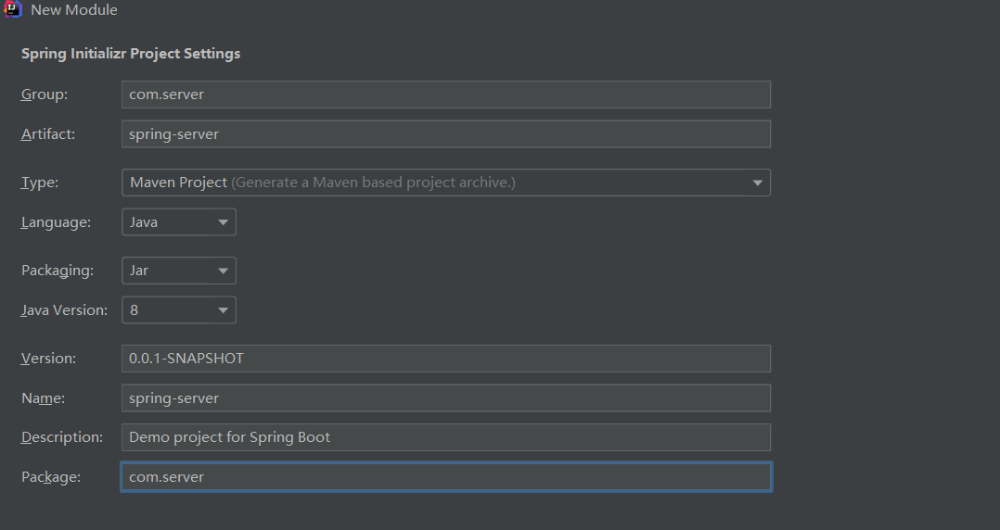
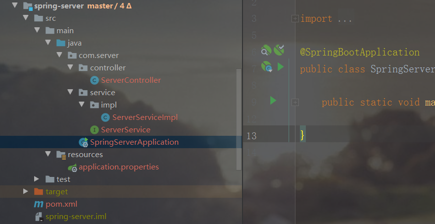
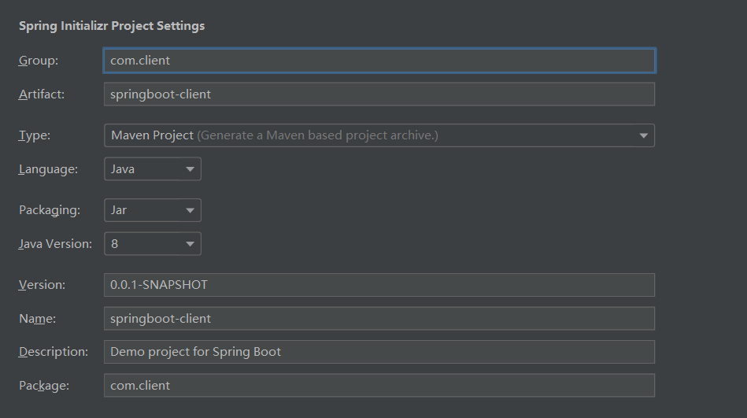
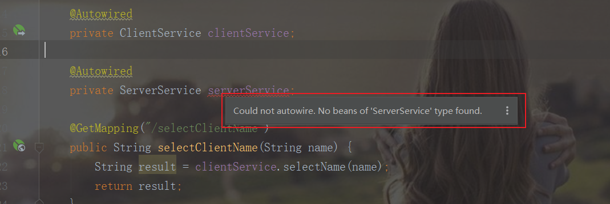
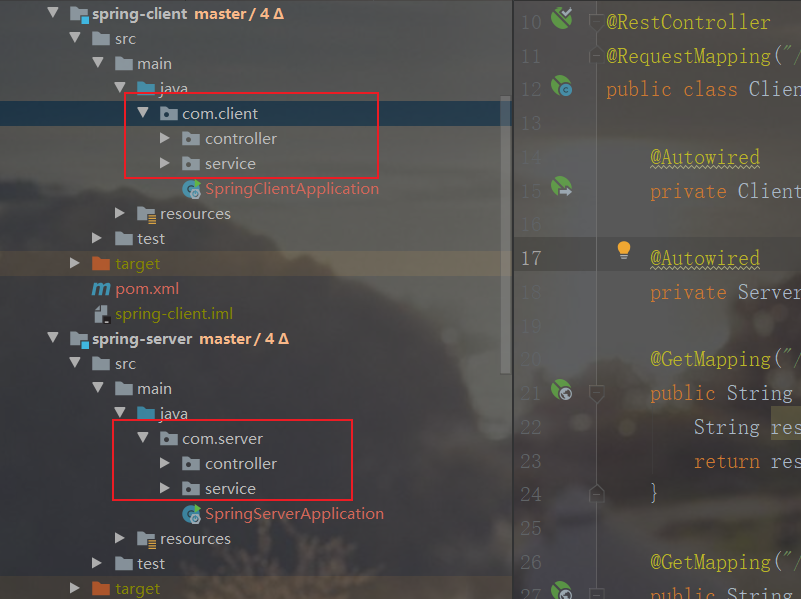
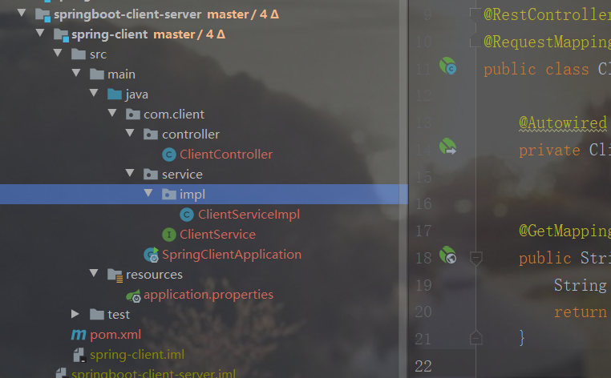
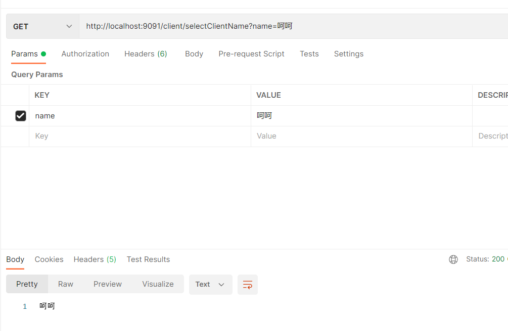
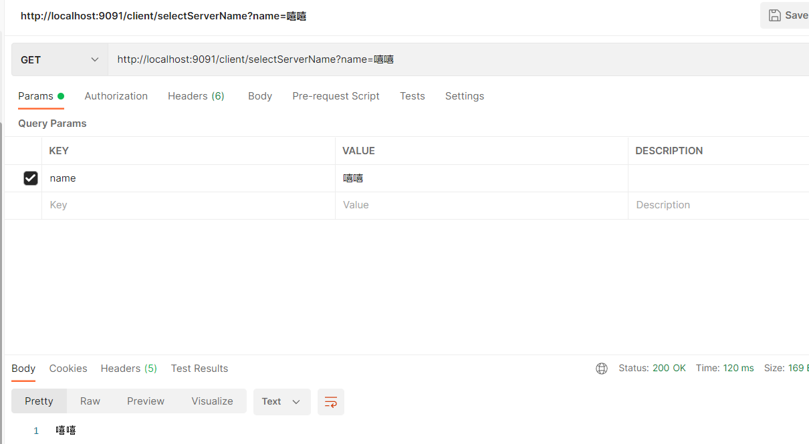
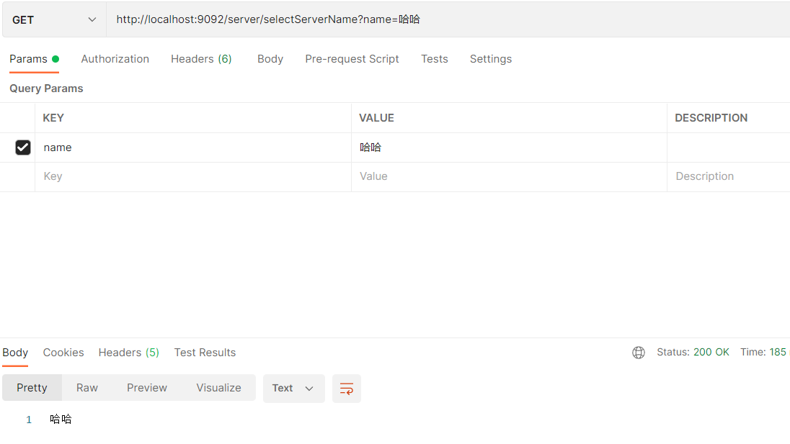

# [SpringBoot项目多个启动类模块之间相互调用](https://www.cnblogs.com/liyhbk/p/16399548.html)

## 1. 项目整体结构

### 1.2 先创建 spring-server 模块，在 spring-client 模块引用 spring-server 模块的依赖

## 2. 搭建 spring-server 模块

### 2.1 创建一个 springboot 工程模块



### 2.2 修改 pom 文件

```xml
<dependencies>
        <dependency>
            <groupId>org.springframework.boot</groupId>
            <artifactId>spring-boot-starter</artifactId>
        </dependency>

        <dependency>
            <groupId>org.springframework.boot</groupId>
            <artifactId>spring-boot-starter-test</artifactId>
            <scope>test</scope>
        </dependency>

        <dependency>
            <groupId>org.springframework.boot</groupId>
            <artifactId>spring-boot-starter-web</artifactId>
        </dependency>
    </dependencies>
```

### 2.3 修改 application.properties 文件

```yaml
server.port=9092
```

### 2.4 创建 ServerController

```java
package com.server.controller;

import com.server.service.ServerService;
import org.springframework.beans.factory.annotation.Autowired;
import org.springframework.web.bind.annotation.GetMapping;
import org.springframework.web.bind.annotation.RequestMapping;
import org.springframework.web.bind.annotation.RestController;

@RestController
@RequestMapping("/server")
public class ServerController {

    @Autowired
    private ServerService serverService;

    @GetMapping("/selectServerName")
    public String selectServerName(String name) {
        String result = serverService.selectName(name);
        return result;
    }

}
```

### 2.5 创建 ServerService 接口和实现类 ServerServiceImpl

```java
package com.server.service;

public interface ServerService {

    String selectName(String name);

}
package com.server.service.impl;

import com.server.service.ServerService;
import org.springframework.stereotype.Service;

@Service
public class ServerServiceImpl implements ServerService {

    @Override
    public String selectName(String name) {
        return name;
    }

}
```

### 2.6 spring-server 模块结构



## 3. 搭建 spring-client 模块

### 3.1 创建一个 springboot 工程模块



### 3.2 修改 pom 文件，添加 spring-server 模块的依赖

```xml
<dependencies>
    <dependency>
        <groupId>org.springframework.boot</groupId>
        <artifactId>spring-boot-starter</artifactId>
    </dependency>

    <dependency>
        <groupId>org.springframework.boot</groupId>
        <artifactId>spring-boot-starter-test</artifactId>
        <scope>test</scope>
    </dependency>

    <dependency>
        <groupId>org.springframework.boot</groupId>
        <artifactId>spring-boot-starter-web</artifactId>
    </dependency>

    <dependency>
        <groupId>com.server</groupId>
        <artifactId>spring-server</artifactId>
        <version>0.0.1-SNAPSHOT</version>
    </dependency>
</dependencies>
```

### 3.3 修改 application.properties 文件

```yaml
server.port=9091
```

### 3.4 创建 ClientController

```java
package com.client.controller;

import com.client.service.ClientService;
import com.server.service.ServerService;
import org.springframework.beans.factory.annotation.Autowired;
import org.springframework.web.bind.annotation.GetMapping;
import org.springframework.web.bind.annotation.RequestMapping;
import org.springframework.web.bind.annotation.RestController;

@RestController
@RequestMapping("/client")
public class ClientController {

    @Autowired
    private ClientService clientService;

    @Autowired
    private ServerService serverService;

    @GetMapping("/selectClientName")
    public String selectClientName(String name) {
        String result = clientService.selectName(name);
        return result;
    }

    @GetMapping("/selectServerName")
    public String selectServerName(String name) {
        String result = serverService.selectName(name);
        return result;
    }

}
```

### 3.5 创建 ClientService 接口和实现类 ClientServiceImpl

```java
package com.client.service;

public interface ClientService {

    String selectName(String name);

}
package com.client.service.impl;

import com.client.service.ClientService;
import org.springframework.stereotype.Service;

@Service
public class ClientServiceImpl implements ClientService {

    @Override
    public String selectName(String name) {
        return name;
    }

}
```

### 3.6 注入 ServerService 之后发现注入失败了，原因是 spring-client 和 spring-server 下面的包结构不同

 

### 3.7 修改 spring-client 启动类，加入扫描包的注解

```java
@ComponentScan(basePackages = {"com.client", "com.server"})
package com.client;

import org.springframework.boot.SpringApplication;
import org.springframework.boot.autoconfigure.SpringBootApplication;
import org.springframework.context.annotation.ComponentScan;

@SpringBootApplication
@ComponentScan(basePackages = {"com.client", "com.server"})
public class SpringClientApplication {

    public static void main(String[] args) {
        SpringApplication.run(SpringClientApplication.class, args);
    }

}
```

### 3.8 spring-client 模块结构



## 4. 测试接口功能

### 4.1 测试 spring-client 模块接口 /client/selectClientName

```http
http://localhost:9091/client/selectClientName?name=呵呵
```



### 4.2 测试 spring-client 模块接口 /client/selectServerName

```http
http://localhost:9091/client/selectServerName?name=嘻嘻
```



### 4.3 测试 spring-server 模块接口 /server/selectServerName

```http
http://localhost:9092/server/selectServerName?name=哈哈
```



### 4.4 完整项目地址：[springboot-client-server](https://gitee.com/liyhGitee/springboot/tree/master/springboot-client-server)