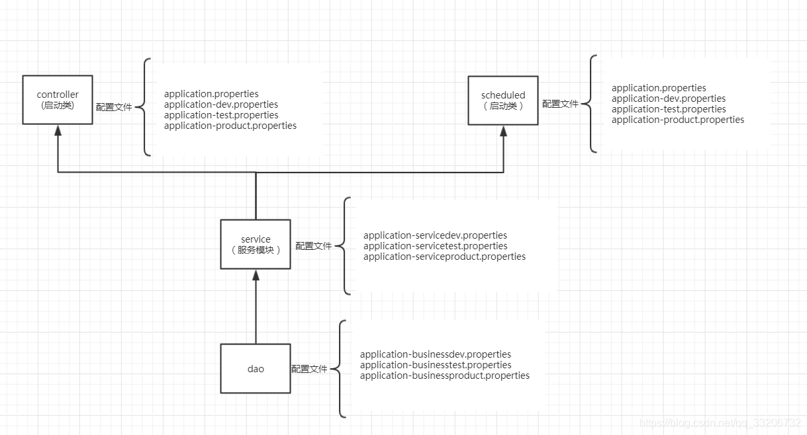
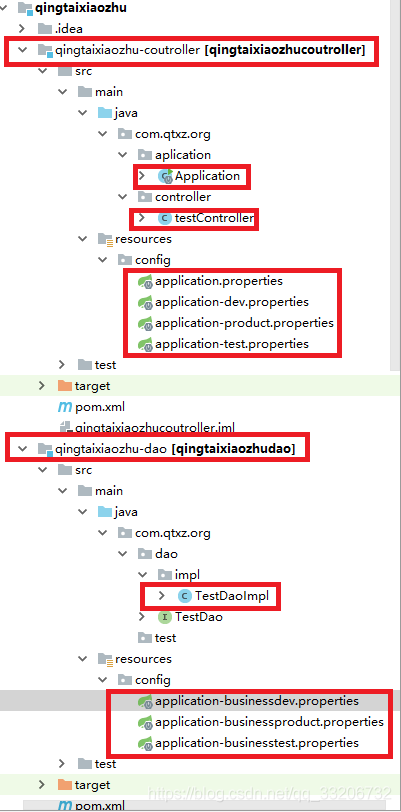
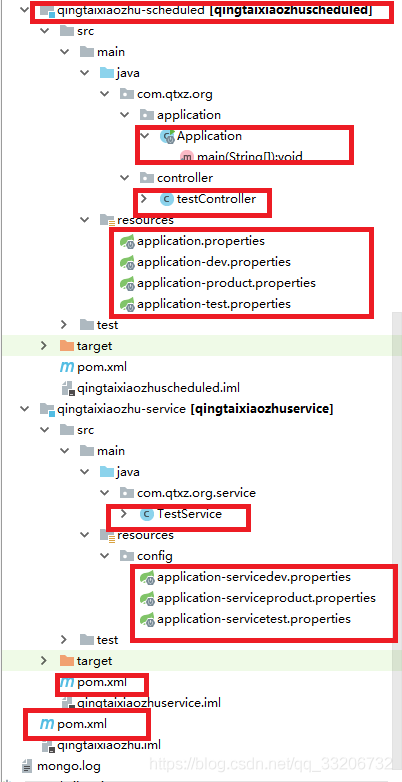
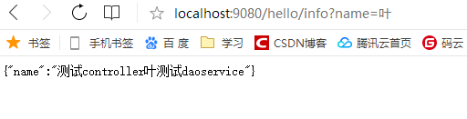

[SpringBoot实现一个项目多模块，多主启动模块，每个模块多环境配置文件](https://www.cnblogs.com/sunny3158/p/16570552.html)

https://blog.csdn.net/qq_33206732/article/details/87552244
SpringBoot实现一个项目多模块，多主启动模块，每个模块多环境配置文件

我们在日常开发过程中，在新建一个项目中，我们经常会将一个项目按照功能性、模块等将一个项目分成多个子项目，这些子项目都包含在主项目中。
对于Spring、SpringBoot中实现多模块化，网上有很多教程，这里就不在讲述了。

本次主要讲的是如何在一个项目中能够有两个Application，即有两个启动类，启动不同的启动类，能够访问不同的功能，另外我们开发项目时，需要将配置分为开发环境、测试环境、生产环境，对于不同环境的参数配置，我们虽然可以将所有配置配置在一个文件中，在打包时根据环境屏蔽放开对应的参数配置，但是这样不仅繁琐，而且经常会导致不必要的错误。

另外SpringBoot/Spring 均有在打包时选择不同的配置文件的实现，但是SpringBoot项目实现不同环境的配置只能够在主项目中进行区分，那么如果子项目想要根据环境配置参数，也必须在主项目中配置，这样的话耦合度比较高，不适合扩展，另外如果是两个Application使用同一个子模块，那么这两个项目均要配置相同的参数配置，非常麻烦。所以该篇将的就是如何处理该问题。

这个项目主要结构如下图

从上图可以看出，这一个项目中包含了controller、scheduled两个启动类项目，这两个启动类项目均引用service、service又引用了dao项目。

我们想要实现的结果是service的不同环境的配置信息，放在其自己的配置文件中，而不是放在controller或者scheduled的配置文件中，因为那样的话我们得配置两边，非常不灵活。
如上图所示的配置文件就可以实现非常灵活的配置，自己模块的参数配置，仅仅配置在自己的文件中，到时候拆分项目、引用项目都非常的容易了。

废话不多说，直接贴代码：

## parent

因为这里的项目均为一个项目的多个子模块，我们知道其有个父模块的，所以我们可以把很多公用的配置放在父模块中，那样的话子模块的pom.xml配置的东西就非常的少了，方便阅读。
**pom.xml**

```xml
<?xml version="1.0" encoding="UTF-8"?>
<project xmlns="http://maven.apache.org/POM/4.0.0"
         xmlns:xsi="http://www.w3.org/2001/XMLSchema-instance"
         xsi:schemaLocation="http://maven.apache.org/POM/4.0.0 http://maven.apache.org/xsd/maven-4.0.0.xsd">
    <modelVersion>4.0.0</modelVersion>
    <groupId>wechat-qingtaixiaozhu</groupId>
    <artifactId>qingtaixiaozhu</artifactId>
    <packaging>pom</packaging>
    <version>1.0-SNAPSHOT</version>
    <!-- 子模块-->
    <modules>
        <module>qingtaixiaozhu-service</module>
        <module>qingtaixiaozhu-dao</module>
        <module>qingtaixiaozhu-coutroller</module>
        <module>qingtaixiaozhu-scheduled</module>
    </modules>
    <!-- 引用springBoot父项目-->
    <parent>
        <groupId>org.springframework.boot</groupId>
        <artifactId>spring-boot-starter-parent</artifactId>
        <version>2.0.5.RELEASE</version>
        <relativePath/>
    </parent>
    <!--统一管理依赖的版本号-->
    <dependencies>
        <dependency>
            <groupId>org.springframework.boot</groupId>
            <artifactId>spring-boot-starter-web</artifactId>
            <version>1.5.2.RELEASE</version>
        </dependency>
        <dependency>
            <groupId>org.springframework.boot</groupId>
            <artifactId>spring-boot-dependencies</artifactId>
            <type>pom</type>
            <scope>import</scope>
            <version>1.5.2.RELEASE</version>
        </dependency>
        <dependency>
            <groupId>org.springframework.boot</groupId>
            <artifactId>spring-boot-starter-data-redis</artifactId>
            <version>1.5.2.RELEASE</version>
        </dependency>
        <dependency>
            <groupId>org.springframework.boot</groupId>
            <artifactId>spring-boot-starter-test</artifactId>
            <version>1.5.1.RELEASE</version>
        </dependency>
        <dependency>
            <groupId>log4j</groupId>
            <artifactId>log4j</artifactId>
            <version>1.2.17</version>
        </dependency>
    </dependencies>
    <!-- 环境信息 -->
    <profiles>
        <!-- 标机开发环境 -->
        <profile>
            <id>dev</id>
            <properties>
                <activeProfile>dev</activeProfile>
                <serviceactive>servicedev</serviceactive>
                <businessactive>businessdev</businessactive>
            </properties>
            <activation>
                <activeByDefault>true</activeByDefault>
            </activation>
        </profile>
        <!-- 测试环境 -->
        <profile>
            <id>test</id>
            <properties>
                <activeProfile>test</activeProfile>
                <serviceactive>servicetest</serviceactive>
                <businessactive>businesstest</businessactive>
            </properties>
            <activation>
                <activeByDefault>false</activeByDefault>
            </activation>
        </profile>
        <!-- 生产环境 -->
        <profile>
            <id>product</id>
            <properties>
                <activeProfile>product</activeProfile>
                <serviceactive>serviceproduct</serviceactive>
                <businessactive>businessproduct</businessactive>
            </properties>
            <activation>
                <activeByDefault>false</activeByDefault>
            </activation>
        </profile>
    </profiles>
</project>
  
```

父项目的pom.xml主要是配置了都需要的SpringBoot的相关引用，这样的话我们子项目完全不需要再重复引用了。另外其配置了`profiles`属性，这个属性是让我们区分多环境是打包哪些配置文件，其id参数就是我们的要打包环境的一个标识，比如我们打包测试环境我们只需要执行`clean install -Ptest`即可，-P后面的值即为这个id值，其中`properties`属性里面的列表是标识该环境生效的配置文件，属性里面的是SpringBoot配置文件后面的值，比如`application-serviceproduct.properties`其值就为`serviceproduct`。

## controller

**Application.java**

```typescript
package com.qtxz.org.aplication;
import org.springframework.boot.SpringApplication;
import org.springframework.boot.autoconfigure.SpringBootApplication;
import org.springframework.context.annotation.ComponentScan;
@SpringBootApplication
@ComponentScan("com.qtxz.org")
public class Application {
    public static void main(String[] args) {
            SpringApplication.run(Application.class, args);
    }
}
```

**pom.xml**

```xml
<?xml version="1.0" encoding="UTF-8"?>
<project xmlns="http://maven.apache.org/POM/4.0.0"
         xmlns:xsi="http://www.w3.org/2001/XMLSchema-instance"
         xsi:schemaLocation="http://maven.apache.org/POM/4.0.0 http://maven.apache.org/xsd/maven-4.0.0.xsd">
    <modelVersion>4.0.0</modelVersion>
    <artifactId>qingtaixiaozhu-coutroller</artifactId>
    <version>1.0-SNAPSHOT</version>
    <packaging>jar</packaging>
    <parent>
        <artifactId>qingtaixiaozhu</artifactId>
        <groupId>wechat-qingtaixiaozhu</groupId>
        <version>1.0-SNAPSHOT</version>
    </parent>
    <properties>
        <project.build.sourceEncoding>UTF-8</project.build.sourceEncoding>
        <java.version>1.10</java.version>
    </properties>
    <dependencies>
        <!--service依赖-->
        <dependency>
            <groupId>wechat-qingtaixiaozhu</groupId>
            <artifactId>qingtaixiaozhu-service</artifactId>
            <version>1.0-SNAPSHOT</version>
        </dependency>
    </dependencies>
    <!-- 打包 -->
    <build>
        <resources>
            <resource>
                <filtering>true</filtering>
                <directory>src/main/resources</directory>
            </resource>
        </resources>
        <plugins>
            <plugin>
                <groupId>org.apache.maven.plugins</groupId>
                <artifactId>maven-compiler-plugin</artifactId>
                <version>2.3.2</version>
                <configuration>
                    <source>1.8</source>
                    <target>1.8</target>
                    <encoding>${project.build.sourceEncoding}</encoding>
                </configuration>
            </plugin>
            <plugin>
                <groupId>org.apache.maven.plugins</groupId>
                <artifactId>maven-resources-plugin</artifactId>
                <version>2.4.3</version>
                <configuration>
                    <encoding>${project.build.sourceEncoding}</encoding>
                </configuration>
            </plugin>
            <plugin>
                <groupId>org.apache.maven.plugins</groupId>
                <artifactId>maven-jar-plugin</artifactId>
                <version>2.2</version>
            </plugin>
            <plugin>
                <groupId>org.springframework.boot</groupId>
                <artifactId>spring-boot-maven-plugin</artifactId>
                <version>1.5.2.RELEASE</version>
                <configuration>
                    <mainClass>com.qtxz.org.aplication.Application</mainClass>
                </configuration>
                <executions>
                    <execution>
                        <goals>
                            <goal>repackage</goal>
                        </goals>
                    </execution>
                </executions>
            </plugin>
        </plugins>
    </build>
</project>
```

**application.properties**

```ini
#端口号配置
server.port=9080
#各模块配置文件
spring.profiles.active=@activeProfile@,@serviceactive@,@businessactive@
12345
```

**application-dev.properties**

```ini
test1=测试controller
1
```

用于测试不同环境去不同环境的配置文件参数

**testController.java**
测试类controller

```typescript
package com.qtxz.org.controller;
import com.qtxz.org.service.TestService;
import org.springframework.beans.factory.annotation.Autowired;
import org.springframework.beans.factory.annotation.Value;
import org.springframework.stereotype.Controller;
import org.springframework.web.bind.annotation.RequestMapping;
import org.springframework.web.bind.annotation.RequestParam;
import org.springframework.web.bind.annotation.ResponseBody;
import java.util.HashMap;
import java.util.Map;
@Controller
@RequestMapping("/hello")
public class testController {

@Autowired
TestService testService;

@Value("${test1}")
private String test1;

@RequestMapping("/info")
@ResponseBody
public Map&lt;String, String&gt; getInfo(@RequestParam String name) {
    Map&lt;String, String&gt; map = new HashMap&lt;&gt;();
    map.put("name", test1+ testService.testService(name));
    return map;
}


}


@Autowired
TestService testService;

@Value("${test1}")
private String test1;

@RequestMapping("/info")
@ResponseBody
public Map&lt;String, String&gt; getInfo(@RequestParam String name) {
    Map&lt;String, String&gt; map = new HashMap&lt;&gt;();
    map.put("name", test1+ testService.testService(name));
    return map;
}
```

## service

**pom.xml**

```xml
<?xml version="1.0" encoding="UTF-8"?>
<project xmlns="http://maven.apache.org/POM/4.0.0"
         xmlns:xsi="http://www.w3.org/2001/XMLSchema-instance"
         xsi:schemaLocation="http://maven.apache.org/POM/4.0.0 http://maven.apache.org/xsd/maven-4.0.0.xsd">
    <modelVersion>4.0.0</modelVersion>
    <artifactId>qingtaixiaozhu-service</artifactId>
    <version>1.0-SNAPSHOT</version>
    <packaging>jar</packaging>
    <parent>
        <artifactId>qingtaixiaozhu</artifactId>
        <groupId>wechat-qingtaixiaozhu</groupId>
        <version>1.0-SNAPSHOT</version>
    </parent>
    <dependencies>
        <!--dao依赖-->
        <dependency>
            <groupId>wechat-qingtaixiaozhu</groupId>
            <artifactId>qingtaixiaozhu-dao</artifactId>
            <version>1.0-SNAPSHOT</version>
        </dependency>
    </dependencies>
</project>
```

**application-servicedev.properties**

```ini
test2=service
1
```

**TestService.java**

```typescript
package com.qtxz.org.service;
import com.qtxz.org.dao.TestDao;
import org.springframework.beans.factory.annotation.Autowired;
import org.springframework.beans.factory.annotation.Value;
import org.springframework.stereotype.Service;
@Service
public class TestService {

@Autowired
private TestDao testDao;


@Value("${test2}")
private String test;

public String testService(String name){
    return testDao.testDaos(name)+test;
}


}


@Autowired
private TestDao testDao;


@Value("${test2}")
private String test;

public String testService(String name){
    return testDao.testDaos(name)+test;
}
```

## dao

**pom.xml**

```xml
<?xml version="1.0" encoding="UTF-8"?>
<project xmlns="http://maven.apache.org/POM/4.0.0"
         xmlns:xsi="http://www.w3.org/2001/XMLSchema-instance"
         xsi:schemaLocation="http://maven.apache.org/POM/4.0.0 http://maven.apache.org/xsd/maven-4.0.0.xsd">
    <modelVersion>4.0.0</modelVersion>
    <artifactId>qingtaixiaozhu-dao</artifactId>
    <version>1.0-SNAPSHOT</version>
    <packaging>jar</packaging>
    <parent>
        <artifactId>qingtaixiaozhu</artifactId>
        <groupId>wechat-qingtaixiaozhu</groupId>
        <version>1.0-SNAPSHOT</version>
    </parent>
    <dependencies>
        <dependency>
            <groupId>org.springframework.boot</groupId>
            <artifactId>spring-boot-starter-web</artifactId>
        </dependency>
        <dependency>
            <groupId>org.springframework.boot</groupId>
            <artifactId>spring-boot-starter-test</artifactId>
            <scope>test</scope>
        </dependency>
    </dependencies>
</project>
```

**application-businessdev.properties**

```ini
test3=测试dao
1
```

**TestDaoImpl.java**

```typescript
package com.qtxz.org.dao.impl;
import com.qtxz.org.dao.TestDao;
import org.springframework.beans.factory.annotation.Value;
import org.springframework.stereotype.Repository;
@Repository
public class TestDaoImpl implements TestDao {
    @Value("${test3}")
    private String test;
    @Override
    public String testDaos(String name) {
        return name + test;
    }
}
```

## scheduled

定时项目配置基本与controller一致，这里就不展开了

## 所有项目基本结构如下图



## 测试

启动controller项目：

```vhdl
D:\JDK\bin\java -agentlib:jdwp=transport=dt_socket,address=127.0.0.1:54670,suspend=y,server=n -XX:TieredStopAtLevel=1 -noverify -Dspring.output.ansi.enabled=always -Dcom.sun.management.jmxremote -Dcom.sun.management.jmxremote.port=54669 -Dcom.sun.management.jmxremote.authenticate=false -Dcom.sun.management.jmxremote.ssl=false -Djava.rmi.server.hostname=localhost -Dspring.liveBeansView.mbeanDomain -Dspring.application.admin.enabled=true -javaagent:C:\Users\Administrator\.IntelliJIdea2018.1\system\captureAgent\debugger-agent.jar=file:/C:/Users/Administrator/AppData/Local/Temp/capture.props -Dfile.encoding=UTF-8 -classpath "D:\ideaWorkSpace\qingtaixiaozhu\qingtaixiaozhu-coutroller\target\classes;D:\ideaWorkSpace\qingtaixiaozhu\qingtaixiaozhu-service\target\classes;D:\ideaWorkSpace\qingtaixiaozhu\qingtaixiaozhu-dao\target\classes;D:\maven_repository\org\springframework\boot\spring-boot-starter-web\1.5.2.RELEASE\spring-boot-starter-web-1.5.2.RELEASE.jar;D:\maven_repository\org\springframework\boot\spring-boot-starter\2.0.5.RELEASE\spring-boot-starter-2.0.5.RELEASE.jar;D:\maven_repository\org\springframework\boot\spring-boot\2.0.5.RELEASE\spring-boot-2.0.5.RELEASE.jar;D:\maven_repository\org\springframework\boot\spring-boot-autoconfigure\2.0.5.RELEASE\spring-boot-autoconfigure-2.0.5.RELEASE.jar;D:\maven_repository\org\springframework\boot\spring-boot-starter-logging\2.0.5.RELEASE\spring-boot-starter-logging-2.0.5.RELEASE.jar;D:\maven_repository\ch\qos\logback\logback-classic\1.2.3\logback-classic-1.2.3.jar;D:\maven_repository\ch\qos\logback\logback-core\1.2.3\logback-core-1.2.3.jar;D:\maven_repository\org\apache\logging\log4j\log4j-to-slf4j\2.10.0\log4j-to-slf4j-2.10.0.jar;D:\maven_repository\org\apache\logging\log4j\log4j-api\2.10.0\log4j-api-2.10.0.jar;D:\maven_repository\org\slf4j\jul-to-slf4j\1.7.25\jul-to-slf4j-1.7.25.jar;D:\maven_repository\javax\annotation\javax.annotation-api\1.3.2\javax.annotation-api-1.3.2.jar;D:\maven_repository\org\yaml\snakeyaml\1.19\snakeyaml-1.19.jar;D:\maven_repository\org\springframework\boot\spring-boot-starter-tomcat\2.0.5.RELEASE\spring-boot-starter-tomcat-2.0.5.RELEASE.jar;D:\maven_repository\org\apache\tomcat\embed\tomcat-embed-core\8.5.34\tomcat-embed-core-8.5.34.jar;D:\maven_repository\org\apache\tomcat\embed\tomcat-embed-el\8.5.34\tomcat-embed-el-8.5.34.jar;D:\maven_repository\org\apache\tomcat\embed\tomcat-embed-websocket\8.5.34\tomcat-embed-websocket-8.5.34.jar;D:\maven_repository\org\hibernate\hibernate-validator\5.3.4.Final\hibernate-validator-5.3.4.Final.jar;D:\maven_repository\javax\validation\validation-api\2.0.1.Final\validation-api-2.0.1.Final.jar;D:\maven_repository\org\jboss\logging\jboss-logging\3.3.2.Final\jboss-logging-3.3.2.Final.jar;D:\maven_repository\com\fasterxml\classmate\1.3.4\classmate-1.3.4.jar;D:\maven_repository\com\fasterxml\jackson\core\jackson-databind\2.9.6\jackson-databind-2.9.6.jar;D:\maven_repository\com\fasterxml\jackson\core\jackson-annotations\2.9.0\jackson-annotations-2.9.0.jar;D:\maven_repository\com\fasterxml\jackson\core\jackson-core\2.9.6\jackson-core-2.9.6.jar;D:\maven_repository\org\springframework\spring-web\5.0.9.RELEASE\spring-web-5.0.9.RELEASE.jar;D:\maven_repository\org\springframework\spring-beans\5.0.9.RELEASE\spring-beans-5.0.9.RELEASE.jar;D:\maven_repository\org\springframework\spring-webmvc\5.0.9.RELEASE\spring-webmvc-5.0.9.RELEASE.jar;D:\maven_repository\org\springframework\spring-aop\5.0.9.RELEASE\spring-aop-5.0.9.RELEASE.jar;D:\maven_repository\org\springframework\spring-context\5.0.9.RELEASE\spring-context-5.0.9.RELEASE.jar;D:\maven_repository\org\springframework\spring-expression\5.0.9.RELEASE\spring-expression-5.0.9.RELEASE.jar;D:\maven_repository\org\springframework\boot\spring-boot-starter-data-redis\1.5.2.RELEASE\spring-boot-starter-data-redis-1.5.2.RELEASE.jar;D:\maven_repository\org\springframework\data\spring-data-redis\2.0.10.RELEASE\spring-data-redis-2.0.10.RELEASE.jar;D:\maven_repository\org\springframework\data\spring-data-keyvalue\2.0.10.RELEASE\spring-data-keyvalue-2.0.10.RELEASE.jar;D:\maven_repository\org\springframework\data\spring-data-commons\2.0.10.RELEASE\spring-data-commons-2.0.10.RELEASE.jar;D:\maven_repository\org\springframework\spring-tx\5.0.9.RELEASE\spring-tx-5.0.9.RELEASE.jar;D:\maven_repository\org\springframework\spring-oxm\5.0.9.RELEASE\spring-oxm-5.0.9.RELEASE.jar;D:\maven_repository\org\springframework\spring-context-support\5.0.9.RELEASE\spring-context-support-5.0.9.RELEASE.jar;D:\maven_repository\org\slf4j\slf4j-api\1.7.25\slf4j-api-1.7.25.jar;D:\maven_repository\redis\clients\jedis\2.9.0\jedis-2.9.0.jar;D:\maven_repository\org\apache\commons\commons-pool2\2.5.0\commons-pool2-2.5.0.jar;D:\maven_repository\org\springframework\boot\spring-boot-starter-test\1.5.1.RELEASE\spring-boot-starter-test-1.5.1.RELEASE.jar;D:\maven_repository\org\springframework\boot\spring-boot-test\2.0.5.RELEASE\spring-boot-test-2.0.5.RELEASE.jar;D:\maven_repository\org\springframework\boot\spring-boot-test-autoconfigure\2.0.5.RELEASE\spring-boot-test-autoconfigure-2.0.5.RELEASE.jar;D:\maven_repository\com\jayway\jsonpath\json-path\2.4.0\json-path-2.4.0.jar;D:\maven_repository\net\minidev\json-smart\2.3\json-smart-2.3.jar;D:\maven_repository\net\minidev\accessors-smart\1.2\accessors-smart-1.2.jar;D:\maven_repository\org\ow2\asm\asm\5.0.4\asm-5.0.4.jar;D:\maven_repository\junit\junit\4.12\junit-4.12.jar;D:\maven_repository\org\assertj\assertj-core\3.9.1\assertj-core-3.9.1.jar;D:\maven_repository\org\mockito\mockito-core\2.15.0\mockito-core-2.15.0.jar;D:\maven_repository\net\bytebuddy\byte-buddy\1.7.11\byte-buddy-1.7.11.jar;D:\maven_repository\net\bytebuddy\byte-buddy-agent\1.7.11\byte-buddy-agent-1.7.11.jar;D:\maven_repository\org\objenesis\objenesis\2.6\objenesis-2.6.jar;D:\maven_repository\org\hamcrest\hamcrest-core\1.3\hamcrest-core-1.3.jar;D:\maven_repository\org\hamcrest\hamcrest-library\1.3\hamcrest-library-1.3.jar;D:\maven_repository\org\skyscreamer\jsonassert\1.5.0\jsonassert-1.5.0.jar;D:\maven_repository\com\vaadin\external\google\android-json\0.0.20131108.vaadin1\android-json-0.0.20131108.vaadin1.jar;D:\maven_repository\org\springframework\spring-core\5.0.9.RELEASE\spring-core-5.0.9.RELEASE.jar;D:\maven_repository\org\springframework\spring-jcl\5.0.9.RELEASE\spring-jcl-5.0.9.RELEASE.jar;D:\maven_repository\org\springframework\spring-test\5.0.9.RELEASE\spring-test-5.0.9.RELEASE.jar;D:\maven_repository\log4j\log4j\1.2.17\log4j-1.2.17.jar;D:\IntelliJ IDEA 2018.1\lib\idea_rt.jar" com.qtxz.org.aplication.Application
Connected to the target VM, address: '127.0.0.1:54670', transport: 'socket'


.   ____          _            __ _ _

/\ / ' __ _ () __  __ _ \ \ \ 

( ( )__ | '_ | '| | ' / ` | \ \ \ 

\/  )| |)| | | | | || (| |  ) ) ) )

'  || .__|| ||| |_, | / / / /

=========||==============|/=////

:: Spring Boot ::        (v2.0.5.RELEASE)


2019-02-17 20:29:09.876  INFO 2540 --- [           main] com.qtxz.org.aplication.Application      : Starting Application on ZGDBXRR9HUMWHT8 with PID 2540 (D:\ideaWorkSpace\qingtaixiaozhu\qingtaixiaozhu-coutroller\target\classes started by Administrator in D:\ideaWorkSpace)

2019-02-17 20:29:09.879  INFO 2540 --- [           main] com.qtxz.org.aplication.Application      : The following profiles are active: dev,servicedev,businessdev

2019-02-17 20:29:09.941  INFO 2540 --- [           main] ConfigServletWebServerApplicationContext : Refreshing org.springframework.boot.web.servlet.context.AnnotationConfigServletWebServerApplicationContext@f80945f: startup date [Sun Feb 17 20:29:09 CST 2019]; root of context hierarchy

2019-02-17 20:29:10.438  INFO 2540 --- [           main] .s.d.r.c.RepositoryConfigurationDelegate : Multiple Spring Data modules found, entering strict repository configuration mode!

WARNING: An illegal reflective access operation has occurred

WARNING: Illegal reflective access by org.springframework.cglib.core.ReflectUtils$1 (file:/D:/maven_repository/org/springframework/spring-core/5.0.9.RELEASE/spring-core-5.0.9.RELEASE.jar) to method java.lang.ClassLoader.defineClass(java.lang.String,byte[],int,int,java.security.ProtectionDomain)

WARNING: Please consider reporting this to the maintainers of org.springframework.cglib.core.ReflectUtils$1

WARNING: Use --illegal-access=warn to enable warnings of further illegal reflective access operations

WARNING: All illegal access operations will be denied in a future release

2019-02-17 20:29:10.974  INFO 2540 --- [           main] o.s.b.w.embedded.tomcat.TomcatWebServer  : Tomcat initialized with port(s): 9080 (http)

2019-02-17 20:29:10.995  INFO 2540 --- [           main] o.apache.catalina.core.StandardService   : Starting service [Tomcat]

2019-02-17 20:29:10.995  INFO 2540 --- [           main] org.apache.catalina.core.StandardEngine  : Starting Servlet Engine: Apache Tomcat/8.5.34

2019-02-17 20:29:11.000  INFO 2540 --- [ost-startStop-1] o.a.catalina.core.AprLifecycleListener   : The APR based Apache Tomcat Native library which allows optimal performance in production environments was not found on the java.library.path: [D:\JDK\bin;C:\windows\Sun\Java\bin;C:\windows\system32;C:\windows;C:\Program Files (x86)\Common Files\Oracle\Java\javapath;C:\ProgramData\Oracle\Java\javapath;C:\windows\system32;C:\windows;C:\windows\System32\Wbem;C:\windows\System32\WindowsPowerShell\v1.0;D:\apache-maven-3.5.3\bin;D:\MySql\mysql-8.0.11-winx64\bin;D:\Git\cmd;C:\Users\Administrator\AppData\Local\Microsoft\WindowsApps;D:\jdk_8.0.1440.1\bin;D:\Fiddler;.]

2019-02-17 20:29:11.082  INFO 2540 --- [ost-startStop-1] o.a.c.c.C.[Tomcat].[localhost].[/]       : Initializing Spring embedded WebApplicationContext

2019-02-17 20:29:11.082  INFO 2540 --- [ost-startStop-1] o.s.web.context.ContextLoader            : Root WebApplicationContext: initialization completed in 1147 ms

2019-02-17 20:29:11.151  INFO 2540 --- [ost-startStop-1] o.s.b.w.servlet.ServletRegistrationBean  : Servlet dispatcherServlet mapped to [/]

2019-02-17 20:29:11.156  INFO 2540 --- [ost-startStop-1] o.s.b.w.servlet.FilterRegistrationBean   : Mapping filter: 'characterEncodingFilter' to: [/]

2019-02-17 20:29:11.156  INFO 2540 --- [ost-startStop-1] o.s.b.w.servlet.FilterRegistrationBean   : Mapping filter: 'hiddenHttpMethodFilter' to: [/]

2019-02-17 20:29:11.156  INFO 2540 --- [ost-startStop-1] o.s.b.w.servlet.FilterRegistrationBean   : Mapping filter: 'httpPutFormContentFilter' to: [/]

2019-02-17 20:29:11.156  INFO 2540 --- [ost-startStop-1] o.s.b.w.servlet.FilterRegistrationBean   : Mapping filter: 'requestContextFilter' to: [/]

2019-02-17 20:29:11.294  INFO 2540 --- [           main] o.s.w.s.handler.SimpleUrlHandlerMapping  : Mapped URL path [//favicon.ico] onto handler of type [class org.springframework.web.servlet.resource.ResourceHttpRequestHandler]

2019-02-17 20:29:11.569  INFO 2540 --- [           main] s.w.s.m.m.a.RequestMappingHandlerAdapter : Looking for @ControllerAdvice: org.springframework.boot.web.servlet.context.AnnotationConfigServletWebServerApplicationContext@f80945f: startup date [Sun Feb 17 20:29:09 CST 2019]; root of context hierarchy

2019-02-17 20:29:11.632  INFO 2540 --- [           main] s.w.s.m.m.a.RequestMappingHandlerMapping : Mapped "{[/hello/info]}" onto public java.util.Map<java.lang.String, java.lang.String> com.qtxz.org.controller.testController.getInfo(java.lang.String)

2019-02-17 20:29:11.635  INFO 2540 --- [           main] s.w.s.m.m.a.RequestMappingHandlerMapping : Mapped "{[/error]}" onto public org.springframework.http.ResponseEntity<java.util.Map<java.lang.String, java.lang.Object>> org.springframework.boot.autoconfigure.web.servlet.error.BasicErrorController.error(javax.servlet.http.HttpServletRequest)

2019-02-17 20:29:11.636  INFO 2540 --- [           main] s.w.s.m.m.a.RequestMappingHandlerMapping : Mapped "{[/error],produces=[text/html]}" onto public org.springframework.web.servlet.ModelAndView org.springframework.boot.autoconfigure.web.servlet.error.BasicErrorController.errorHtml(javax.servlet.http.HttpServletRequest,javax.servlet.http.HttpServletResponse)

2019-02-17 20:29:11.662  INFO 2540 --- [           main] o.s.w.s.handler.SimpleUrlHandlerMapping  : Mapped URL path [/webjars/] onto handler of type [class org.springframework.web.servlet.resource.ResourceHttpRequestHandler]

2019-02-17 20:29:11.662  INFO 2540 --- [           main] o.s.w.s.handler.SimpleUrlHandlerMapping  : Mapped URL path [/**] onto handler of type [class org.springframework.web.servlet.resource.ResourceHttpRequestHandler]

2019-02-17 20:29:11.947  INFO 2540 --- [           main] o.s.j.e.a.AnnotationMBeanExporter        : Registering beans for JMX exposure on startup

2019-02-17 20:29:11.981  INFO 2540 --- [           main] o.s.b.w.embedded.tomcat.TomcatWebServer  : Tomcat started on port(s): 9080 (http) with context path ''

2019-02-17 20:29:11.987  INFO 2540 --- [           main] com.qtxz.org.aplication.Application      : Started Application in 2.464 seconds (JVM running for 3.465)
```

**调用测试方法**


可以看到返回的参数均为其各环境自己的参数

**注：**
如果一个参数，上层下层均配置了，那么其会默认取上层参数。