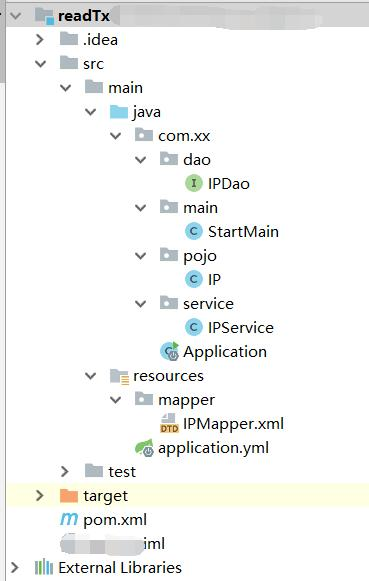

## SPRINGBOOT 写普通JAVA工程/控制台项目

1.引入maven依赖

```xml
<dependency>
  <groupId>org.springframework.boot</groupId>
  <artifactId>spring-boot-starter</artifactId>
  <version>2.0.9</version>
</dependency>
```

2.实现接口

```java
@Component
public class StartMain implements CommandLineRunner {
    @Autowired
    private IPService ipService;
    //真正的入口函数
    @Override
    public void run(String... args) throws Exception {
        //coding
    }
}
```

3.Application （SpringApplication.run 一开始我写的是StartMain.class,发现依赖注入死活不行，然后改成Application.class OK）

```java
package com.xx;

import org.springframework.boot.SpringApplication;
import org.springframework.boot.autoconfigure.SpringBootApplication;

@SpringBootApplication
public class Application {
    public static void main(String[] args) {
        SpringApplication.run(Application.class, args);
    }
}
```

//目录结构



 