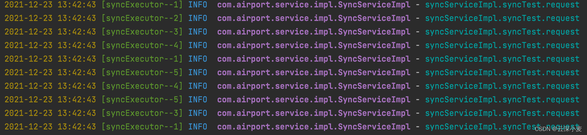
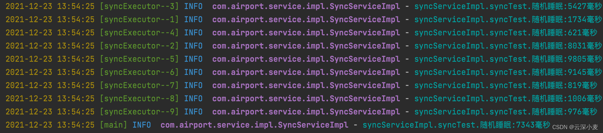

### springboot-executor

#### 线程池创建

    @Configuration
    @EnableAsync
    public class TaskPoolConfig {
    
        @Bean("syncExecutorPool")
        public Executor taskExecutor() {
            ThreadPoolTaskExecutor taskExecutor = new ThreadPoolTaskExecutor();
            // 核心池大小
            taskExecutor.setCorePoolSize(5);
            // 最大线程数
            taskExecutor.setMaxPoolSize(10);
            // 队列程度
            taskExecutor.setQueueCapacity(100);
            // 线程空闲时间
            taskExecutor.setKeepAliveSeconds(60);
            // 线程前缀名称
            taskExecutor.setThreadNamePrefix("syncExecutor--");
            // 该方法用来设置 线程池关闭 的时候 等待 所有任务都完成后，再继续 销毁 其他的 Bean，
            // 这样这些 异步任务 的 销毁 就会先于 数据库连接池对象 的销毁。
            taskExecutor.setWaitForTasksToCompleteOnShutdown(true);
            // 任务的等待时间 如果超过这个时间还没有销毁就 强制销毁，以确保应用最后能够被关闭，而不是阻塞住。
            taskExecutor.setAwaitTerminationSeconds(300);
            // 线程不够用时由调用的线程处理该任务
            taskExecutor.setRejectedExecutionHandler(new ThreadPoolExecutor.CallerRunsPolicy());
            return taskExecutor;
        }
    }

#### 线程池参数

##### 核心线程数量：CorePoolSize
看业务场景设置（我通常设置为CPU核心*1）

##### 最大线程数量：MaxPoolSize
当核心线程数量都在使用状态时，会调用最大线程数量里的线程，使用的总线程不会超过最大线程数量，其余则等待（我通常设置为CPU核心*2）

##### 队列程度：QueueCapacity
线程队列的大小

##### 线程空闲时间：KeepAliveSeconds

##### 线程前缀名称：ThreadNamePrefix

##### 停机策略：WaitForTasksToCompleteOnShutdown
该方法用来设置 线程池关闭 的时候 等待 所有任务都完成后，再继续 销毁 其他的 Bean，这样这些 异步任务 的 销毁 就会先于 数据库连接池对象 的销毁。

##### 任务的等待时间：AwaitTerminationSeconds
任务的等待时间 如果超过这个时间还没有销毁就 强制销毁，以确保应用最后能够被关闭，而不是阻塞住

##### 拒接策略：RejectedExecutionHandler
线程不够用时由调用的线程处理该任务

#### 线程池测试1（核心线程数量）

结果：线程池的核心线程数量轮训执行

#### 线程池测试2（当核心线程数量和最大线程数量不够时）

随机睡眠0-10000毫秒
new Random().nextInt(10000)

    @Override
    @Async("syncExecutorPool")
    public void syncTest() {
        try {
            int i = new Random().nextInt(10000);
            log.info("syncServiceImpl.syncTest.随机睡眠:{}毫秒", i);
            Thread.sleep(i);
        } catch (Exception e) {
            e.printStackTrace();
        }
    }

结果：

当5个核心线程数量不够用时，使用最大线程数量里的线程

当最大线程数量不够用时，使用主线程执行该任务

// 线程不够用时由调用的线程处理该任务

    taskExecutor.setRejectedExecutionHandler(new ThreadPoolExecutor.CallerRunsPolicy());
