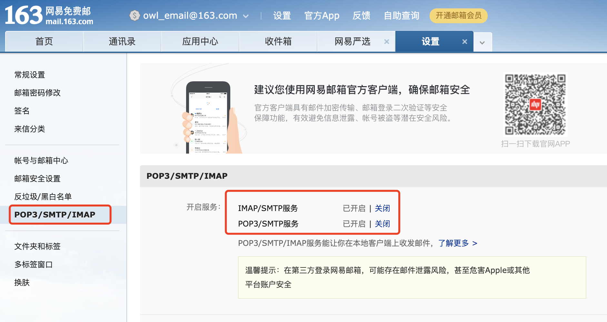
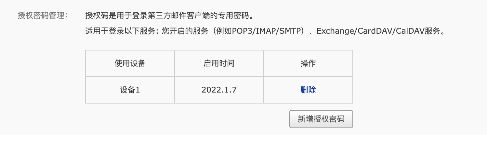
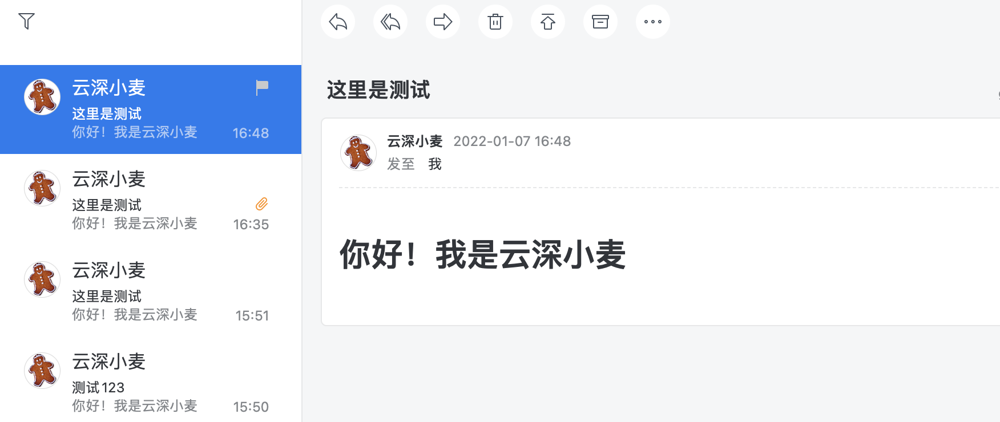

> Springboot+Javamail实现邮件发送
> 
> 使用的是spring-context-support-5.2.6.RELEASE.jar里的javamail
> 
> javamail 官方文档：[javamail](https://javaee.github.io/javamail/)

**代码在：[gitee](https://gitee.com/indexT/springboot-demo)**

## 官方代码介绍
Sample code for an HTML mail with an inline image and a PDF attachment:
> 带有图像和PDF附件的HTML邮件的示例代码：

```java
mailSender.send(new MimeMessagePreparator() {
            public void prepare(MimeMessage mimeMessage) throws MessagingException {
                MimeMessageHelper message = new MimeMessageHelper(mimeMessage, true, "UTF-8");
                message.setFrom("me@mail.com");
                message.setTo("you@mail.com");
                message.setSubject("my subject");
                message.setText("my text ", true);
                message.addInline("myLogo", new ClassPathResource("img/mylogo.gif"));
                message.addAttachment("myDocument.pdf", new ClassPathResource("doc/myDocument.pdf"));
            }
        });
```

## MimeMessageHelper参数说明
- from（发件人）
- to（收件人）
- subject（邮件主题）
- text（内容）
- inline（内嵌图片或者图片附件）
- attachment（附件）
- cc（抄送人）
- bcc（密送人）

## Springboot 代码示例

### 开启POP3/SMTP服务，并拿到授权码

> 首先登录[163邮箱](https://mail.163.com/) 开启POP3/SMTP服务



> **拿到授权码**
> 
> application.yml配置文件不要填邮箱密码，要填授权码，不然会报错：535 Error: authentication failed



### application.yml配置文件
```yaml

spring:
  mail:
    default-encoding: UTF-8
    host: smtp.163.com
    username: owl_email@163.com
    # 不要填邮箱密码，要填授权码，不然会报错：535 Error: authentication failed
    password: 
    protocol: smtp
    properties:
      mail:
        smtp:
          auth: true
          port: 994 #465或者994
          starttls:
            enable: true
            required: true
          ssl:
            enable: true
      display:
        sendmail: Javen
        sendname: Spring Boot Guide Email

```

### MailDetail（参数封装）
> 记得setter、getter
```java

public class MailDetail {
    /**
     * 发件人名称
     */
    private String senderName;

    /**
     * 发件人邮件地址
     */
    private String senderMail;

    /**
     * 收件人地址
     */
    private String addresseeMail;

    /**
     * 邮件标题
     */
    private String mailTitle;

    /**
     * 抄送人
     */
    private String[] cc;

    /**
     * 邮件内容
     */
    private String content;

    /**
     * true内容为HTML，false内容为文本 默认文本
     */
    private Boolean html = false;

}


```
### 发送邮件Service层
```java

@Service
public class MailServiceImpl implements MailService {
    private static final Logger log = LoggerFactory.getLogger(MailServiceImpl.class);

    private final JavaMailSender javaMailSender;

    @Autowired
    public MailServiceImpl(JavaMailSender javaMailSender) {
        this.javaMailSender = javaMailSender;
    }

    @Override
    public boolean sendMessage(MailDetail detail) {
        log.info("mailServiceImpl.sendMessage.request:{}", new Gson().toJson(detail));
        try {
            MimeMessage message = javaMailSender.createMimeMessage();
            MimeMessageHelper messageHelper = new MimeMessageHelper(message, true);
            // 发件人地址
            InternetAddress fromAddress = new InternetAddress(MimeUtility.encodeText(detail.getSenderName()) + "<" + detail.getSenderMail() + ">");
            messageHelper.setFrom(fromAddress);
            // 收件人地址
            InternetAddress toAddress = new InternetAddress(MimeUtility.encodeText(detail.getAddresseeMail()) + "<" + detail.getAddresseeMail() + ">");
            messageHelper.setTo(toAddress);
            // 邮件名称
            messageHelper.setSubject(detail.getMailTitle());
            // 第二个参数指定发送的是HTML格式
            messageHelper.setText(detail.getContent(), detail.getHtml());
            // 抄送人
            if (detail.getCc() != null && detail.getCc().length > 0) {
                messageHelper.setCc(detail.getCc());
            }
            // 测试图片附件（ClassPathResource要把图片放到resources，并且编译代码把图片加载到target里）
//            messageHelper.addInline("myLogo", new ClassPathResource("WechatIMG2602.jpeg"));
            javaMailSender.send(message);
            return true;
        } catch (MessagingException | UnsupportedEncodingException e) {
            log.error("mailServiceImpl.sendMessage.error:{},{}", e.getMessage(), e.getStackTrace());
        }
        return false;
    }
}

```
### 发送邮件Controller层
> 主要controller实现类ApplicationRunner 的run 项目启动则执行
```java

@RestController
public class MailController implements ApplicationRunner {
    private static final Logger log = LoggerFactory.getLogger(MailController.class);

    protected final MailService mailService;

    @Autowired
    public MailController(MailService mailService) {
        this.mailService = mailService;
    }


    @Override
    public void run(ApplicationArguments args) throws Exception {
        log.info("syncController.run");
        MailDetail mailDetail = new MailDetail();
        // 发件人名称
        mailDetail.setSenderName("云深小麦");
        // 发件人邮箱
        mailDetail.setSenderMail("owl_email@163.com");
        // 邮件名称
        mailDetail.setMailTitle("这里是测试");
        // 收件人邮箱
        mailDetail.setAddresseeMail("guoqingyan_email@163.com");
        // 发送纯文本 setHtml(false) 默认false
//        mailDetail.setContent("你好！我是云深小麦");

        // 发送HTML setHtml(true)
        mailDetail.setContent("<html><head></head><body><h1>你好！我是云深小麦</h1></body></html>");
        // 内容是否为HTML
        mailDetail.setHtml(true);

        boolean b = mailService.sendMessage(mailDetail);
        if (b) {
            log.info("发送成功");
        }
    }
}

```
## 结果


## 一些问题
### 535 Error: authentication failed

Caused by: javax.mail.AuthenticationFailedException: 535 Error: authentication failed

调用163邮箱服务器来发送邮件,我们需要开启POP3/SMTP服务,这时163邮件会让我们设置客户端授权码，这个授权码替代上面代码部分的passwd即可成功发送邮件

[如何重置授权码](https://help.mail.163.com/faqDetail.do?code=d7a5dc8471cd0c0e8b4b8f4f8e49998b374173cfe9171305fa1ce630d7f67ac21b8ba4d48ed49ebc)

### 550 Invalid User

com.sun.mail.smtp.SMTPSenderFailedException: 550 Invalid User

该错误表示：收件地址为无效帐号。

建议：

1，请检查收件人地址是否存在语法错误，例如说有携带多余的标点符号。地址与地址之间的分隔号是英文字符下的分号。

2，请检查收件人地址是否有错误，收件人不存在等情况。

3，请检查发件人在系统的状态，是否被删除、禁用或者冻结状态。